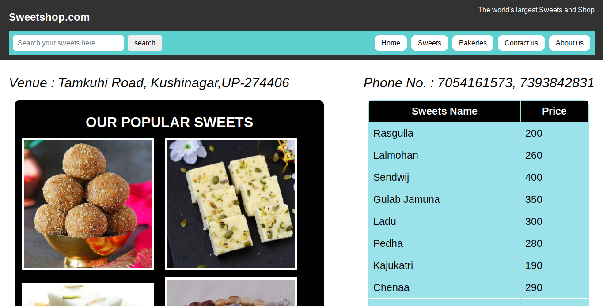

# 🍭 Sweetshop – Delight in Every Bite!

A beautifully designed **Sweetshop website** using HTML, CSS, and JavaScript.  
Explore delicious sweets, view prices, and order online with ease.

---

## 📸 Screenshots

> 📷 Home Page Preview  

> 🎥 Live Demo (Screen Recording)  
<video id="previewVideo" width="100%" muted autoplay loop style="border-radius: 12px; box-shadow: 0 4px 12px rgba(0,0,0,0.3); cursor: pointer;"> <source src="WebsiteOverview.webm" type="video/mp4"> Your browser does not support the video tag. </video> 

---

## ✨ Features

- 🍬 Popular sweets with images and pricing  
- 🛒 Online order form (name, mobile, address, quantity)  
- 📋 Tabular sweet price list  
- 🧁 Bakery and sweets pages  
- 📱 Responsive layout for different screens  
- 📌 Address, contact info, and social links  
- 🎨 Simple, clean, and festive UI

---

## 💻 Technologies Used

- HTML5  
- CSS3  
- JavaScript (vanilla)

---

>
👨‍💻 Author
Developed By: Sonu Yadav

📷 Instagram: @sanatni_sonu__678

📞 Contact for Project or Collaboration: sy2440052@gmail.com

---

## 📬 For Contact / Project Inquiry

If you want a similar sweetshop website or any project like this:
> 📩 **Email me at:** sy2440052@gmail.com  
> 📲 **DM on Instagram:** [@sanatni_sonu__678](https://www.instagram.com/sanatni_sonu__678)

---
